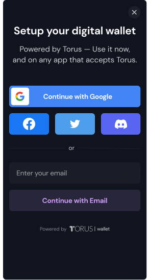

# Wallet

## wallet คืออะไร?

crypto wallet คือ digital wallet ที่ใช้ติดต่อกับ blockchain เพื่อ sign, verify, และส่ง transactions ในปัจจุบันมี crypto wallet solutions มากมายในตลาด, ตั้งแต่ simple-to-use web apps จนไปถึง hardware security solutions ที่ซับซ้อน.

## Social Logins บน Solana

[**Web3Auth**](https://docs.web3auth.io/) ทำให้ users สามารถ sign in โดยใช้ Web2 OAuth Providers(Facebook, Google, Twitter etc.) ที่มีอยู่แล้วไปยัง Web3 dapps. มันจะใช้งายง่าย และใช้วิธี [non-custodial](https://docs.web3auth.io/key-infrastructure/overview) เพื่อจัดการ assets และ identity. มันทำให้ technical barriers ลดลง และลดการเรียนรู้เรื่อง digital ownership สำหรับ users ทุกคนโดยซ่อนการจัดการ private key ไว้

## แนวทางการ Integration

ในตัวอย่างนี้จะเป็นแนวทางง่ายๆ ในการ integrate social logins เข้าไปใน dapp ของเรา

### การติดตั้ง Dependencies

เริ่มโดยใช้ wallet ที่มี dapp, เราสามารถลง `@toruslabs/solana-embed`. โดยใช้ package managers ต่างๆ เช่น yarn และ npm เพื่อติดตั้ง.

<CodeGroup>
  <CodeGroupItem title="YARN" active>

```bash
yarn add @toruslabs/solana-embed
```

  </CodeGroupItem>

  <CodeGroupItem title="NPM">

```bash
npm install --save @toruslabs/solana-embed
```

  </CodeGroupItem>
</CodeGroup>

### การใช้ SDK และ initialize

ในตัวอย่าง code สั้นๆ ด้านล่าง เราจะสร้าง instance ของ solana-embed แล้ว init มันด้วย testing environment ที่ใช้ solana testnet. เราสามารถส่งค่าตัวเลือกเพื่อ config ในระหว่าง init wallet interface. เราสามารถอ่าน solana-embed [api-reference](https://docs.tor.us/solana-wallet/api-reference/class) เพื่อเรียนรู้เพิ่มเติม

<SolanaCodeGroup>
  <SolanaCodeGroupItem title="TS" active>

  <template v-slot:default>

@[code](@/code/wallet/Web3Auth/initialize-instance.en.ts)

  </template>

  <template v-slot:preview>

@[code](@/code/wallet/Web3Auth/initialize-instance.preview.en.ts)

  </template>

  </SolanaCodeGroupItem>
</SolanaCodeGroup>

### Trigger user login​

เราสามารถเรียก `torus.login()` เพื่อ trigger การ login ที่ไหนก็ได้ที่ต้องการใน app  การเรีนก login method โดยไม่ส่ง parameter มาด้วยจะเป็นการเปิด modal ให้ user เลือกตัวเลือก logins ที่มีอยู่



หลังจาก login สำเร็จ method จะคืนค่า array ของ public keys มา โดย element แรกของ array คือ wallet public key ปัจจุบัน

<SolanaCodeGroup>
  <SolanaCodeGroupItem title="TS" active>

  <template v-slot:default>

@[code](@/code/wallet/Web3Auth/login.en.ts)

  </template>

  <template v-slot:preview>

@[code](@/code/wallet/Web3Auth/login.preview.en.ts)

  </template>

  </SolanaCodeGroupItem>
</SolanaCodeGroup>

### การช้ torus instance เพื่อดึงข้อมูลรายละเอียด user account

torus instance จะมี interface สำหรับ sign transactions และ messages ใน logged-in state. และมันยังมี interface สำหรับเข้าถึงข้อมูล user login เช่น email, profile image ฯลฯ. (ขึ้นอยู่กับ login method)

<SolanaCodeGroup>
  <SolanaCodeGroupItem title="TS" active>

  <template v-slot:default>

@[code](@/code/wallet/Web3Auth/user-info.en.ts)

  </template>

  <template v-slot:preview>

@[code](@/code/wallet/Web3Auth/user-info.preview.en.ts)

  </template>

  </SolanaCodeGroupItem>
</SolanaCodeGroup>

### การใช้ Torus Solana API เพื่อ sign message.

ในการส่ง message ให้ user sign, web app ต้องให้ UTF-8 encoded string เป็น Uint8Array.

ทุกๆ ครั้งที่ user ต้องการ sign message, wallet จะเปิดหน้าต่างยืนยันขึ้นมา

<SolanaCodeGroup>
  <SolanaCodeGroupItem title="TS" active>

  <template v-slot:default>

@[code](@/code/wallet/Web3Auth/sign-message.en.ts)

  </template>

  <template v-slot:preview>

@[code](@/code/wallet/Web3Auth/sign-message.preview.en.ts)

  </template>

  </SolanaCodeGroupItem>
</SolanaCodeGroup>

เช่นกัน, เราสามารถใช้ methods [signTransaction](https://docs.tor.us/solana-wallet/api-reference/solana/sign-transaction) และ `signAllTransactions` บน torus instance เพื่อ sign single, multiple transactions ตามลำดับ.

### การใช้ torus Solana API เพื่อส่ง transaction.​

การส่ง transaction ทำได้ง่ายไ ด้วยการเรียก method `sendTransaction` บน torus instance และส่ง `Transaction` เข้าไปด้วย

wallet จะเปิดหน้าต่างยืนยัน หลังจากยืนยันแล้ว SDK ก็จะ signs และส่ง transaction ไปที่ chain.

<SolanaCodeGroup>
  <SolanaCodeGroupItem title="TS" active>

  <template v-slot:default>

@[code](@/code/wallet/Web3Auth/send-transaction.en.ts)

  </template>

  <template v-slot:preview>

@[code](@/code/wallet/Web3Auth/send-transaction.preview.en.ts)

  </template>

  </SolanaCodeGroupItem>
</SolanaCodeGroup>

### Top-ups​

ในตอนนี้ API สนับสนุนการเติมเงินจาก Moonpay

<SolanaCodeGroup>
  <SolanaCodeGroupItem title="TS" active>

  <template v-slot:default>

@[code](@/code/wallet/Web3Auth/topup.en.ts)

  </template>

  <template v-slot:preview>

@[code](@/code/wallet/Web3Auth/topup.preview.en.ts)

  </template>

  </SolanaCodeGroupItem>
</SolanaCodeGroup>

### Logout

การ logout user ทำได้โดยการเรียก function `logout` บน torus wallet instance.

<SolanaCodeGroup>
  <SolanaCodeGroupItem title="TS" active>

  <template v-slot:default>

@[code](@/code/wallet/Web3Auth/logout.en.ts)

  </template>
    
  <template v-slot:preview>
    
@[code](@/code/wallet/Web3Auth/logout.preview.en.ts)
    
  </template>

  </SolanaCodeGroupItem>
</SolanaCodeGroup>

## Resources

* [solana-embed](https://github.com/torusresearch/solana-embed)
* [Api Reference](https://docs.web3auth.io/solana-wallet/api-reference/class)
* [Hosted Demo](https://demo-solana.tor.us/)
* [Sample React Integration](https://github.com/torusresearch/solana-embed-react-demo)
* [Solana Wallet](https://solana.tor.us/)