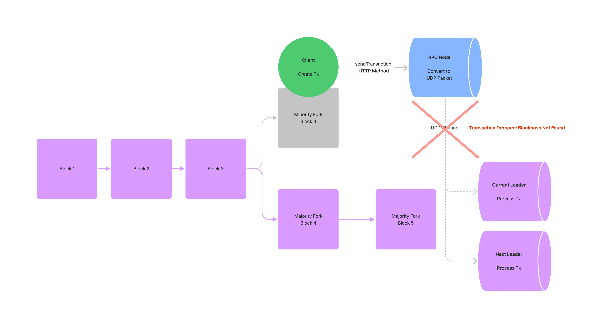

# 重試交易

在某些情況下，一個看似有效的交易可能在輸入區塊之前會被丟棄。這種情況最常發生在網絡擁堵期間，當一個RPC節點無法將交易重新廣播給區塊鏈的[領導](https://docs.solana.com/terminology#leader)節點時。對於最終用戶來說，他們的交易可能會完全消失。雖然RPC節點配備了通用的重新廣播算法，但應用程序開發人員也可以開發自己的自定義重新廣播邏輯。

## 綜述

::: tip 事實表
- RPC節點將嘗試使用通用算法重新廣播交易
- 應用程序開發人員可以實現自定義的重新廣播邏輯
- 開發人員應該利用`sendTransaction` JSON-RPC方法中的`maxRetries`參數
- 開發人員應該啓用預檢查，以便在提交交易之前引發錯誤
- 在重新簽署任何交易之前，**非常重要**的是確保初始交易的塊哈希已過期
:::

## 交易的旅程

### 客戶端如何提交交易

在Solana中，沒有內存池（mempool）的概念。無論是通過編程還是由最終用戶發起，所有的交易都會被高效地路由到領導節點，以便將它們處理成區塊。有兩種主要的方式可以將交易發送給領導節點：
1. 通過RPC服務器和[sendTransaction](https://docs.solana.com/developing/clients/jsonrpc-api#sendtransaction) JSON-RPC 方法進行代理髮送
2. 通過[TPU客戶](https://docs.rs/solana-client/1.7.3/solana_client/tpu_client/index.html) 端直接發送給領導節點

絕大多數最終用戶將通過RPC服務器提交交易。當客戶端提交交易時，接收的RPC節點會嘗試將交易廣播給當前和下一個領導節點。在交易被領導節點處理之前，除了客戶端和中繼的RPC節點知道的內容外，沒有關於交易的記錄。在TPU客戶端的情況下，重新廣播和領導節點的轉發完全由客戶端軟件處理。

### RPC節點如何廣播交易

當RPC節點通過`sendTransaction`接收到一個交易後，它會將交易轉換爲[UDP](https://en.wikipedia.org/wiki/User_Datagram_Protocol) 數據包，然後將其轉發給相關的領導。UDP允許驗證節點之間快速通信，但不提供關於交易傳遞的任何保證。

因爲Solana的領導節點調度在每個[紀元](https://docs.solana.com/terminology#epoch) （大約2天）之前就已知，所以RPC節點會直接將其交易廣播給當前和下一個領導節點。這與其他流言協議（如以太坊）隨機廣播和廣泛傳播整個網絡的交易的方式形成對比。默認情況下，RPC節點會每兩秒嘗試將交易轉發給領導節點，直到交易被確認或交易的塊哈希過期（在本文撰寫時爲150個區塊或約1分鐘19秒）。如果待重新廣播的隊列大小超過[10,000 transactions](https://github.com/solana-labs/solana/blob/bfbbc53dac93b3a5c6be9b4b65f679fdb13e41d9/send-transaction-service/src/send_transaction_service.rs#L20) 個交易，則新提交的交易將被丟棄。RPC運營商可以調整命令行[參數](https://github.com/solana-labs/solana/blob/bfbbc53dac93b3a5c6be9b4b65f679fdb13e41d9/validator/src/main.rs#L1172) 以更改此重試邏輯的默認行爲。

當RPC節點廣播一個交易時，它會嘗試將交易轉發給領導節點的交易處理單元（TPU）。TPU將交易處理分爲五個不同的階段：
- [Fetch Stage](https://github.com/solana-labs/solana/blob/cd6f931223181d5a1d47cba64e857785a175a760/core/src/fetch_stage.rs#L21)
- [SigVerify Stage](https://github.com/solana-labs/solana/blob/cd6f931223181d5a1d47cba64e857785a175a760/core/src/tpu.rs#L91)
- [Banking Stage](https://github.com/solana-labs/solana/blob/cd6f931223181d5a1d47cba64e857785a175a760/core/src/banking_stage.rs#L249)
- [Proof of History Service](https://github.com/solana-labs/solana/blob/cd6f931223181d5a1d47cba64e857785a175a760/poh/src/poh_service.rs)
- [Broadcast Stage](https://github.com/solana-labs/solana/blob/cd6f931223181d5a1d47cba64e857785a175a760/core/src/tpu.rs#L136)

<small style="display:block;text-align:center;">Image Courtesy of Jito Labs</small>

在這五個階段中，Fetch階段負責接收交易。在Fetch階段中，驗證節點會根據三個端口對傳入的交易進行分類：
- [tpu](https://github.com/solana-labs/solana/blob/cd6f931223181d5a1d47cba64e857785a175a760/gossip/src/contact_info.rs#L27) 處理常規交易，例如代幣轉賬、NFT鑄造和程序指令。
- [tpu_vote](https://github.com/solana-labs/solana/blob/cd6f931223181d5a1d47cba64e857785a175a760/gossip/src/contact_info.rs#L31) 專門處理投票交易。
- [tpu_forwards](https://github.com/solana-labs/solana/blob/cd6f931223181d5a1d47cba64e857785a175a760/gossip/src/contact_info.rs#L29) 將未處理的數據包轉發給下一個領導節點，如果當前領導無法處理所有交易。

如需瞭解更多關於TPU的信息，請參考[Jito Labs出色的文章](https://jito-labs.medium.com/solana-validator-101-transaction-processing-90bcdc271143).

## 交易如何被丟棄 

在交易的整個過程中，有幾種情況下交易可能意外從網絡中丟失。

### 在交易被處理之前

如果網絡丟棄一個交易，通常是在交易被領導處理之前發生。UDP [數據包丟失](https://en.wikipedia.org/wiki/Packet_loss) 是可能發生這種情況的最簡單原因。在網絡負載高峯期，驗證節點可能會被大量需要處理的交易壓倒。雖然驗證節點可以通過 `tpu_forwards`,端口轉發多餘的交易，但[轉發](https://github.com/solana-labs/solana/blob/master/core/src/banking_stage.rs#L389). 的數據量是有限的。此外，每個轉發僅限於驗證節點之間的單一跳躍。也就是說，通過`tpu_forwards`端口接收的交易不會被轉發給其他驗證節點。

還有兩個較少爲人知的原因，可能導致交易在被處理之前被丟棄。第一種情況涉及通過RPC池提交的交易。偶爾，RPC池的一部分可能會領先於其他部分。當池中的節點需要共同工作時，這可能會導致問題。在這個例子中，交易的[recentBlockhash](https://docs.solana.com/developing/programming-model/transactions#recent-blockhash) 從池中的先進部分（後端A）查詢。當交易提交到滯後的池中（後端B）時，節點將無法識別先進的塊哈希並丟棄交易。如果開發人員在`sendTransaction`中啓用了[preflight checks](https://docs.solana.com/developing/clients/jsonrpc-api#sendtransaction)， 可以在提交交易時檢測到此問題。

網絡分叉也可能暫時的導致交易丟失。如果驗證在銀行階段重新播放其塊的速度較慢，可能會創建一個少數派分叉。當客戶端構建一個交易時，交易可能引用僅存在於少數派分叉上的`recentBlockhash`。在提交交易後，集羣可能在交易被處理之前切換到其他分叉。在這種情況下，由於找不到塊哈希，交易被丟棄。

### 在交易被處理後，但尚未最終確認之前

如果一個交易引用了來自少數派分叉的`recentBlockhash`，該交易有可能還會進行處理。在這種情況下，交易將由少數派分叉上的領導節點進行處理。當這個領導試圖與不認可少數派分叉的大多數驗證節點達成共識時，它將無法與它們分享已處理的交易。在這種情況下，交易在最終確定之前將被丟棄。

## 處理被丟棄的交易

雖然RPC節點會嘗試重新廣播交易，但它們使用的算法是通用的，往往不適合特定應用的需求。爲了應對網絡擁堵的時候，應用程序開發人員應該自定義自己的重新廣播邏輯。

### 深入瞭解sendTransaction

在提交交易方面，`sendTransaction` RPC方法是開發者可用的主要工具。`sendTransaction`僅負責將交易從客戶端傳遞到RPC節點。如果節點接收到交易，`sendTransaction`將返回用於跟蹤交易的交易ID。成功的響應並不表示該交易將由集羣處理或最終確定。

:::tip
#### 請求參數
- `transaction`: `string` -  完全簽名的交易，以編碼字符串形式表示 
- (可選) `configuration object`: `object` 
    - `skipPreflight`: `boolean` - 如果爲 true，則跳過預檢事務檢查（默認爲 false）
    - (可選) `preflightCommitment`: `string` - 用於針對銀行插槽進行預檢模擬的[承諾](https://docs.solana.com/developing/clients/jsonrpc-api#configuring-state-commitment) 級別（默認爲"finalized"）
    - (可選) `encoding`: `string` - 用於交易數據的編碼方式。可以選擇 "base58"（較慢）或 "base64"（默認爲 "base58")
    - (可選) `maxRetries`: `usize` -  RPC節點重試將交易發送給領導者的最大次數。如果未提供此參數，RPC節點將重試交易，直到交易最終確定或塊哈希過期爲止

#### 響應
- `transaction id`: `string` - 第一個嵌入在交易中的交易簽名，以base-58編碼的字符串形式表示。可以使用該交易ID與 [getSignatureStatuses](https://docs.solana.com/developing/clients/jsonrpc-api#getsignaturestatuses) 一起使用，以輪詢獲取狀態更新。
:::

## 自定義重播邏輯

爲了開發自己的重新廣播邏輯，開發者應該利用`sendTransaction`的`maxRetries`參數。如果提供了`maxRetries`，它將覆蓋RPC節點的默認重試邏輯，允許開發人員在[合理範圍內](https://github.com/solana-labs/solana/blob/98707baec2385a4f7114d2167ef6dfb1406f954f/validator/src/main.rs#L1258-L1274) 手動控制重試過程。

手動重試交易的常見模式涉及臨時存儲來自[getLatestBlockhash](https://docs.solana.com/developing/clients/jsonrpc-api#getlatestblockhash) 的`lastValidBlockHeight`。一旦存儲了該值，應用程序可以[輪詢集羣的blockheight](https://docs.solana.com/developing/clients/jsonrpc-api#getblockheight)， 並在適當的時間間隔內手動重試交易。在網絡擁堵的時期，將`maxRetries`設置爲0並通過自定義算法手動重新廣播是有優勢的。一些應用程序可能採用[指數退避](https://en.wikipedia.org/wiki/Exponential_backoff)， 而其他應用程序（如[Mango](https://www.mango.markets/) ）選擇在恆定間隔內[持續重新提交](https://github.com/blockworks-foundation/mango-ui/blob/b6abfc6c13b71fc17ebbe766f50b8215fa1ec54f/src/utils/send.tsx#L713) 交易，直到發生超時。

<SolanaCodeGroup>
  <SolanaCodeGroupItem title="TS" active>

  <template v-slot:default>

@[code](@/code/retrying-transactions/retry.en.ts)

  </template>

  <template v-slot:preview>

@[code](@/code/retrying-transactions/retry.preview.en.ts)

  </template>

  </SolanaCodeGroupItem>
</SolanaCodeGroup>

當通過`getLatestBlockhash`進行輪詢時，應用程序應該指定其預期的[承諾](https://docs.solana.com/developing/clients/jsonrpc-api#configuring-state-commitment) 級別。通過將承諾級別設置爲`confirmed`（已投票）或`finalized`（在`confirmed`之後約30個塊），應用程序可以避免從少數派分叉輪詢塊哈希。

如果應用程序可以訪問負載均衡器後面的RPC節點，還可以選擇將其工作負載分配給特定節點。爲數據密集型請求提供服務的RPC節點（例如[getProgramAccounts](./get-program-accounts.md)）可能會滯後，並且可能不適合轉發交易。對於處理時間敏感交易的應用程序，最好擁有專用節點僅處理`sendTransaction`操作。

### 跳過預檢的後果

默認情況下，`sendTransaction`將在提交交易之前執行三個預檢查。具體而言，`sendTransaction`將會：

- 驗證所有簽名是否有效
- 檢查引用的塊哈希是否在最近的150個塊內
- 針對預檢查的`preFlightCommitment`，模擬交易與銀行槽位之間的交互

如果其中任何一個預檢查失敗，`sendTransaction`將在提交交易之前引發錯誤。預檢查常常能夠防止交易丟失，並使客戶端能夠優雅地處理錯誤。爲了確保這些常見錯誤得到考慮，建議開發人員將skipPreflight設置爲false。

### 何時重新簽署交易

儘管盡力進行重新廣播，但有時客戶端可能需要重新簽署交易。在重新簽署任何交易之前，非常重要的是確保初始交易的塊哈希已經過期。如果初始塊哈希仍然有效，那麼兩個交易都有可能被網絡接受。對於最終用戶來說，這將看起來好像他們無意中發送了相同的交易兩次。

在Solana中，一旦所引用的塊哈希早於從`getLatestBlockhash`接收到的`lastValidBlockHeight`，可以安全地丟棄已丟棄的交易。開發者應該通過查詢 [`getEpochInfo`](https://docs.solana.com/developing/clients/jsonrpc-api#getepochinfo) 並將其與響應中的`blockHeight`進行比較來跟蹤l`astValidBlockHeight`。一旦一個塊哈希無效，客戶端可以使用新查詢的塊哈希重新簽署。

## 致謝

非常感謝 Trent Nelson、[Jacob Creech](https://twitter.com/jacobvcreech), White Tiger、Le Yafo、[Buffalu](https://twitter.com/buffalu__), 和 [Jito Labs](https://twitter.com/jito_labs) 的審查和反饋。
